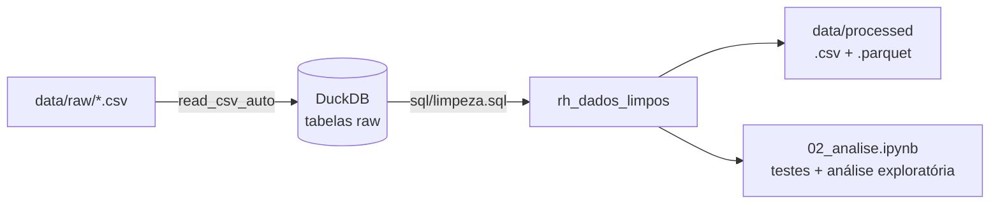

# Análise de Turnover em RH — Escritório de Advocacia


Análise dos dados de RH de um grande escritório de advocacia para identificar **os fatores associados ao desligamento (evasão) de colaboradores**. O projeto cobre o ciclo completo: tratamento dos dados brutos com SQL (DuckDB), testes de hipótese e análise exploratória por departamento e nível de senioridade.

> **Pergunta de negócio:** o que está associado ao desligamento de colaboradores e em quais áreas o problema se concentra?

## Contexto dos dados

A base reúne **650 colaboradores** de um escritório com quatro áreas jurídicas (Civil, Trabalhista, Corporativo e Tributário), quatro níveis de senioridade (Júnior, Pleno, Sênior e Sócio) e filiais na BA, MG, RJ e SP. Os dados chegam em três tabelas relacionadas: `funcionarios`, `departamentos` e `filiais`, com ruídos de formatação e padronização que precisaram ser tratados antes da análise.

---

## Principais resultados

Cerca de 27% dos colaboradores da base estão desligados. O problema não é uniforme: concentra-se em áreas e níveis específicos.
| Achado | Evidência |
|---|---|
| **O turnover se concentra no Trabalhista** | 43,5%, contra 27,5% no Tributário e 17% a 18% no Civil e no Corporativo. O departamento tem 46,3h extras/mês e a menor satisfação (1,67/5,0) |
| **Ausência de promoção é a variável mais associada ao desligamento** | Nunca promovidos: 36,6% de turnover; já promovidos: 8,3% (cerca de 4,4×). Qui-quadrado, p < 0,001 |
| **Sem evidência de viés** | Gênero (p = 0,446), modelo de trabalho (p = 0,810) e estado (p = 0,637) não apresentaram associação com o desligamento |
| **No Trabalhista, saem os Júniores e Plenos** | Júnior 53,1% e Pleno 48,3%, contra Sênior 8,7% e Sócio 0,0%. |
| **Plenos têm turnover alto em todas as áreas** | De 42,4% a 53,4%, inclusive onde a carga é baixa, então a sobrecarga não explica este nível |
| **Sêniores: saída sem suficiente explicação nos dados** | 35,5% (11 de 31), com satisfação alta (4,19) e poucas horas extras (12,1h). Civil e Corporativo têm carga, satisfação, remuneração e promoção semelhantes, mas turnover de 23,8% e 0,0% |
Em comparação descritiva, desligados registram mais horas extras (26,4h contra 18,9h), mais processos ativos (36,5 contra 30,5) e menor satisfação (3,04 contra 3,62). Essa diferença provavelmente é puxada pelo Trabalhista, e não foi submetida a teste de significância.


**Como interpretar:** todos os resultados são **associações observacionais**. As explicações propostas (progressão de carreira, atratividade do mercado, entre outras) são hipóteses, não conclusões causais. Veja as [limitações](#limitações).

### O que os resultados sugerem

1. **Trabalhista:** revisar a distribuição de processos e o planejamento das equipes de Júnior e Pleno, onde se concentram a sobrecarga e a saída.
2. **Plenos:** revisar critérios e prazos de promoção, já que o turnover é alto em todas as áreas, mesmo com carga baixa.
3. **Sêniores:** como as variáveis medidas não parecem explicar a saída, vale combinar mais dados (entrevistas de desligamento, benchmark salarial de mercado e uma análise por gestor direto, variável ainda não explorada).
4. **Gênero, modelo de trabalho e localização** não aparecem como prioridade nesta base.

---

## Estrutura do repositório

```
Projeto_RH_Turnover/
├── data/
│   ├── raw/                    # CSVs originais: funcionarios, departamentos, filiais
│   └── processed/              # rh_dados_limpos.csv e .parquet (gerados pelo notebook 01)
├── notebooks/
│   ├── 01_elt.ipynb            # carga, tratamento e exportação dos dados
│   └── 02_analise.ipynb        # testes de hipótese e análise exploratória
├── sql/
│   └── limpeza.sql             # regras de limpeza e engenharia de variáveis
├── src/
│   └── testes_estatisticos.py  # testes qui-quadrado de associação com o desligamento
├── requirements.txt
└── README.md

```

## Pipeline



O padrão é **ELT**: os CSVs são carregados no DuckDB sem alteração e toda a transformação acontece em SQL, em um arquivo versionado e separado da narrativa do notebook.

## Dicionário de dados (`rh_dados_limpos`)

Tabela final com uma linha por colaborador, resultado da junção das três tabelas originais.

| Grupo | Coluna | Descrição |
|---|---|---|
| **Estrutura** | `id_colaborador` | Identificador único do colaborador |
| | `genero` | Identidade de gênero declarada (Feminino, Masculino, Não-binário) |
| | `nivel` | Senioridade: Júnior, Pleno, Sênior ou Sócio |
| | `id_departamento`, `nome_departamento` | Departamento de atuação (Civil, Trabalhista, Corporativo, Tributário) |
| | `id_chefe_departamento` | Sócio responsável pela gestão do departamento |
| | `id_filial`, `cidade`, `estado` | Filial de alocação e sua localização (UF) |
| | `id_socio_diretor` | Sócio que lidera a filial |
| | `id_reporta_a` | Gestor direto do colaborador (Sócios não possuem) |
| **Carreira e remuneração** | `data_admissao` | Data de contratação |
| | `data_promocao` | Data da **última** promoção (vazia se nunca promovido) |
| | `salario_base` | Salário bruto mensal contratual |
| | `percentual_bonus` | Bônus por performance, em % do salário |
| **Carga e clima** | `processos_ativos` | Processos sob responsabilidade direta no último trimestre |
| | `horas_extras_mes` | Média de horas extras no último mês |
| | `score_satisfacao` | Nota de 1,0 a 5,0 na pesquisa interna e anônima de clima |
| | `home_office` | 1 se trabalha 100% remoto |
| **Status** | `status_atual` | Ativo ou Desligado |
| **Variáveis criadas no projeto** | `desligado` | 1 se `status_atual = 'Desligado'` (variável-alvo) |
| | `promocao` | 1 se já foi promovido ao menos uma vez (`data_promocao` preenchida) |
| | `bonus` | 1 se `percentual_bonus > 0` |
| | `remuneracao_total` | Remuneração mensal equivalente: `salario_base × (1 + percentual_bonus / 100)` |

## Tratamento dos dados

| Problema encontrado | Tratamento |
|---|---|
| Coluna `nome` (dado pessoal sem valor analítico) | Não é incluída na tabela analítica |
| Rótulo inconsistente `Fem` em `genero` | Padronizado para `Feminino` |
| Datas em DD/MM/AAAA | Convertidas para o tipo `DATE` (`TRY_STRPTIME` com `TRY_CAST` como alternativa) |
| Salário como texto (`R$ 1234,56`) | Convertido para `DOUBLE` |
| Coluna `processos_actifs` | Renomeada para `processos_ativos` |
| Tabelas separadas | Unificadas com `LEFT JOIN` em `rh_dados_limpos` |

## Metodologia

| # | Hipótese | Variáveis | Método |
|---|---|---|---|
| H1 | Sobrecarga de trabalho está associada ao desligamento | `horas_extras_mes`, `processos_ativos` | Comparação descritiva de médias |
| H2 | Insatisfação está associada ao desligamento | `score_satisfacao` | Comparação descritiva de médias |
| H3 | Há viés de gênero, modelo de trabalho ou localização | `genero`, `home_office`, `estado` | Qui-quadrado |
| H4 | A ausência de promoção está associada ao desligamento | `promocao` | Qui-quadrado |

- **Análise exploratória:** consultas SQL agrupando por departamento e senioridade. Comparar departamentos dentro do mesmo nível separa melhor o efeito de cada fator, e o total de pessoas acompanha cada percentual, porque subgrupos pequenos são instáveis.


## Decisões técnicas

- **SQL com DuckDB:** lê CSV diretamente, tem tipagem estrita (conversões inválidas geram erro em vez de truncar valores em silêncio) e escala sem reescrita do pipeline. Com o volume atual, o ganho de desempenho é irrelevante, mas simula uma esteira analítica.
- **Duas saídas (CSV e Parquet):** o CSV (`;`, `utf-8-sig`) abre corretamente no Excel em português; o Parquet é colunar, compacto e preserva os tipos, sendo o formato indicado para ferramentas de visualização.


## Limitações

- **Sem data de desligamento ou tempo de casa:** impede curvas de retenção e dificulta interpretar a associação com promoção, já que quem sai cedo tem menos tempo para ser promovido.
- **Sem motivo do desligamento:** a base não separa saída voluntária de demissão pela empresa.
- **Momento das medições desconhecido:** carga de trabalho e satisfação são fotografias, não sabemos quando foram medidas. 
- **`promocao` cresce com o nível** (0% nos Júniores, 30% a 46% nos Plenos, 83% a 90% nos Sêniores), e registra apenas a última promoção. A associação global entre promoção e turnover não pode ser entendida dissociada do nível.
- **Subgrupos pequenos** 
- **Associações, não causas.**


## Como reproduzir
Execute os notebooks **na ordem**: `01_elt.ipynb` (gera o banco DuckDB e os arquivos em `data/processed/`) e depois `02_analise.ipynb`.
## Créditos
Dados fornecidos no Desafio de Nivelamento LACEDA 2026 (Liga Acadêmica de Ciência e Engenharia de Dados). 
